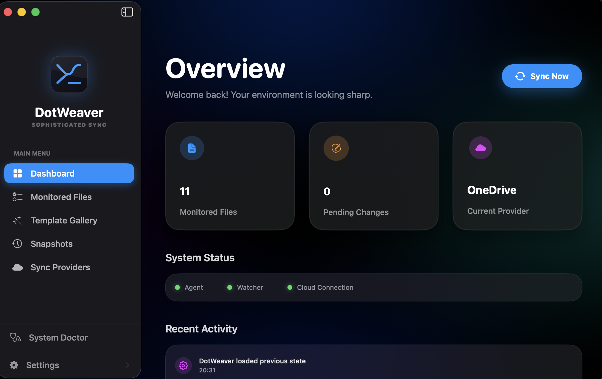

# DotWeaver

DotWeaver is a macOS app for keeping project dotfiles organized, monitored, and synchronized across cloud providers.

## What it does

- Monitors selected dotfiles and configuration files from one desktop app.
- Shows pending changes and recent sync activity from the dashboard.
- Provides snapshot support so configuration states can be reviewed or restored.
- Includes a template gallery for common dotfile setups.
- Supports cloud sync providers from the app settings.
- Includes a system doctor for checking app and sync health.

## App overview

DotWeaver is designed around a sidebar-driven macOS interface:

- **Dashboard** — high-level status, monitored file count, pending changes, provider status, and recent activity.
- **Monitored Files** — dotfiles and configuration files tracked by the app.
- **Template Gallery** — reusable setup templates for common configuration workflows.
- **Snapshots** — saved configuration states.
- **Sync Providers** — cloud provider connection and sync settings.
- **System Doctor** — diagnostics for local app health and sync readiness.
- **Settings** — app preferences and sync configuration.

## Platform

DotWeaver is a native macOS app.

## Development

This repository contains the DotWeaver app source, documentation, release scripts, and app assets.

Useful project paths:

- `Sources/` — Swift app source.
- `Resources/` — bundled app resources.
- `Docs/` — project documentation and README assets.
- `script/` — local development and release helper scripts.

To work on the app locally, open the project in Xcode or use the Swift package tooling available in this repository.
