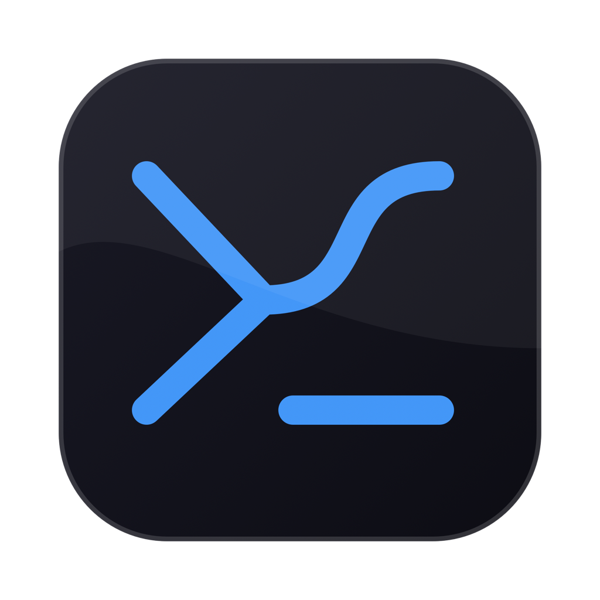

<a id="readme-top"></a>

[![Release][release-shield]][release-url]
[![License][license-shield]][license-url]
[![Platform][platform-shield]][platform-url]
[![Swift][swift-shield]][swift-url]

<br />
<div align="center">
  <a href="https://github.com/rausth/DotWeaver">
    
  </a>

  <h3 align="center">DotWeaver</h3>

  <p align="center">
    Native macOS dotfile manager with provider sync, snapshots, scheduled backups, and a companion CLI.
    <br />
    <a href="Docs/wiki/Home.md"><strong>Explore the docs »</strong></a>
    <br />
    <br />
    <a href="Docs/wiki/Quick-Start.md">Quick Start</a>
    ·
    <a href="Docs/wiki/CLI-Reference.md">CLI Reference</a>
    ·
    <a href="https://github.com/rausth/DotWeaver/issues">Report Bug</a>
    ·
    <a href="https://github.com/rausth/DotWeaver/issues">Request Feature</a>
  </p>
</div>

![DotWeaver app screenshot][product-screenshot]

<details>
  <summary>Table of Contents</summary>
  <ol>
    <li>
      <a href="#about-the-project">About The Project</a>
      <ul>
        <li><a href="#built-with">Built With</a></li>
      </ul>
    </li>
    <li>
      <a href="#getting-started">Getting Started</a>
      <ul>
        <li><a href="#prerequisites">Prerequisites</a></li>
        <li><a href="#installation">Installation</a></li>
      </ul>
    </li>
    <li><a href="#usage">Usage</a></li>
    <li><a href="#features">Features</a></li>
    <li><a href="#architecture">Architecture</a></li>
    <li><a href="#roadmap">Roadmap</a></li>
    <li><a href="#development">Development</a></li>
    <li><a href="#contributing">Contributing</a></li>
    <li><a href="#license">License</a></li>
    <li><a href="#contact">Contact</a></li>
    <li><a href="#acknowledgments">Acknowledgments</a></li>
  </ol>
</details>

## About The Project

DotWeaver keeps project dotfiles organized, monitored, versioned, and synchronized from one native macOS app. It tracks selected configuration files, stores provider-ready metadata, detects conflicts, creates snapshots, and exposes the same workflow through the bundled `dw` CLI.

Use DotWeaver when you want:

- One place to monitor shell, editor, Git, and app configuration files.
- Bidirectional sync across Git, iCloud Drive, OneDrive, Google Drive, Dropbox, WebDAV, SFTP, FTPS, or S3-backed folders.
- Scheduled automatic sync with optional pre-sync backups.
- Snapshot restore for whole configuration states or individual files.
- Local-first security using Keychain, biometric auth, and encrypted vault data.
- CLI automation without abandoning the macOS app UI.

<p align="right">(<a href="#readme-top">back to top</a>)</p>

### Built With

- [![Swift][Swift]][Swift-url]
- [![SwiftUI][SwiftUI]][SwiftUI-url]
- [![Sparkle][Sparkle]][Sparkle-url]
- [![macOS][macOS]][macOS-url]

<p align="right">(<a href="#readme-top">back to top</a>)</p>

## Getting Started

### Prerequisites

- macOS 14 or newer.
- Xcode with Swift 6 toolchain for local development.
- Git for Git-backed sync.
- Optional desktop sync clients or mounted folders for folder-backed providers.

### Installation

1. Download the latest app from [GitHub Releases][release-url].
2. Open `DotWeaver.app`.
3. Follow onboarding and grant access by selecting files/folders inside DotWeaver.
4. Choose a sync provider in Settings.
5. Add your first dotfile from the app or CLI.

For development checkout:

```sh
git clone https://github.com/rausth/DotWeaver.git
cd DotWeaver
swift test
```

<p align="right">(<a href="#readme-top">back to top</a>)</p>

## Usage

### macOS app

DotWeaver uses a sidebar-driven interface:

- **Dashboard** — monitored file count, pending changes, provider status, and recent activity.
- **Monitored Files** — dotfiles and configuration files tracked by the app.
- **Template Gallery** — reusable setup templates for common workflows.
- **Snapshots** — saved configuration states and restore actions.
- **Sync Providers** — provider connection, transport, and sync settings.
- **System Doctor** — local diagnostics and sync readiness checks.
- **Settings** — preferences, scheduled sync, backups, and CLI installation.

### CLI

The bundled `dw` executable supports the same core workflows:

```sh
dw add ~/.zshrc
dw provider set git
dw sync
dw status
```

Snapshots and backup aliases:

```sh
dw snapshot create before-shell-change
dw snapshot list
dw snapshot restore before-shell-change --file ~/.zshrc
```

Provider and system checks:

```sh
dw provider list
dw git status
dw doctor
```

See [CLI Reference](Docs/wiki/CLI-Reference.md) for full command coverage.

<p align="right">(<a href="#readme-top">back to top</a>)</p>

## Features

- Native SwiftUI macOS app with status bar integration.
- Command-line interface: `dw`.
- Bidirectional sync with conflict detection and resolution.
- Providers: Git, iCloud Drive, OneDrive, Google Drive, Dropbox, WebDAV, SFTP, FTPS, S3.
- Folder-backed provider layout by machine identity.
- Scheduled automatic sync with optional pre-sync snapshots.
- Snapshot create, list, restore, delete, machine filtering, and per-file restore.
- Template system with Chezmoi-style variable substitution.
- Built-in file editor with syntax highlighting.
- Touch ID / Face ID authentication with passcode fallback.
- AES.GCM vault encryption with Keychain-protected master key.
- Security-scoped bookmarks for user-selected files and provider folders.
- Sparkle-based update support and release appcast generation.
- No telemetry or analytics collection.

<p align="right">(<a href="#readme-top">back to top</a>)</p>

## Architecture

```text
DotWeaver
├── Sources/DotWeaver          # SwiftUI macOS app
├── Sources/DotWeaverCLI       # dw command-line executable
├── Sources/DotWeaverKit       # Shared sync, snapshot, vault, provider, and model code
├── Tests/DotWeaverKitTests    # Unit and integration tests
├── Docs                       # Documentation, runbooks, changelog, screenshots
├── Resources                  # App resources
└── script                     # Development and release helpers
```

The app and CLI share `DotWeaverKit`, keeping provider sync, snapshots, vault logic, metadata, and tests in one reusable core.

<p align="right">(<a href="#readme-top">back to top</a>)</p>

## Roadmap

See [CHANGELOG](Docs/CHANGELOG.md) for release history and planned work.

Planned for v1.1.0:

- Scheduled automatic sync with optional pre-sync backups.
- Backup and restore workflows built on snapshots.
- Passkey authentication for provider login.
- Team/shared dotfile repositories.
- Linux-native CLI and packaging plan.

Planned for v1.2.0:

- Plugin system for custom providers.
- Visual diff and merge interface.

Linux-native work is planned as a CLI-first port with platform adapters for credentials, scheduling, and packaging.

<p align="right">(<a href="#readme-top">back to top</a>)</p>

## Development

Useful commands:

```sh
swift test
script/smoke_provider_matrix.sh
script/validate_release_local.sh
script/smoke_app_ui.sh
```

Useful paths:

- `Sources/` — Swift app, CLI, and shared kit source.
- `Tests/` — Swift tests.
- `Docs/wiki/` — user and developer documentation.
- `Docs/assets/` — README and project assets.
- `script/` — local validation and release helpers.

<p align="right">(<a href="#readme-top">back to top</a>)</p>

## Contributing

Issues and pull requests are welcome. Before opening a PR:

1. Create a feature branch.
2. Keep changes focused and reviewable.
3. Run `swift test`.
4. Update docs/tests when behavior changes.
5. Open a pull request against `main`.

Read [CONTRIBUTING](Docs/CONTRIBUTING.md) and [CODE OF CONDUCT](Docs/CODE_OF_CONDUCT.md) before contributing.

<p align="right">(<a href="#readme-top">back to top</a>)</p>

## License

Distributed under the MIT License. See [LICENSE](LICENSE) for more information.

<p align="right">(<a href="#readme-top">back to top</a>)</p>

## Contact

Project Link: [https://github.com/rausth/DotWeaver](https://github.com/rausth/DotWeaver)

Issues: [https://github.com/rausth/DotWeaver/issues](https://github.com/rausth/DotWeaver/issues)

<p align="right">(<a href="#readme-top">back to top</a>)</p>

## Acknowledgments

- [Best-README-Template](https://github.com/othneildrew/Best-README-Template) for README structure inspiration.
- [Sparkle](https://sparkle-project.org/) for macOS update support.
- [Shields.io](https://shields.io/) for project badges.

<p align="right">(<a href="#readme-top">back to top</a>)</p>

[release-shield]: https://img.shields.io/github/v/release/rausth/DotWeaver?style=for-the-badge
[release-url]: https://github.com/rausth/DotWeaver/releases
[license-shield]: https://img.shields.io/github/license/rausth/DotWeaver?style=for-the-badge
[license-url]: https://github.com/rausth/DotWeaver/blob/main/LICENSE
[platform-shield]: https://img.shields.io/badge/platform-macOS%2014%2B-blue?style=for-the-badge&logo=apple
[platform-url]: https://www.apple.com/macos/
[swift-shield]: https://img.shields.io/badge/Swift-6.0-orange?style=for-the-badge&logo=swift&logoColor=white
[swift-url]: https://www.swift.org/
[product-screenshot]: Docs/assets/screenshots/dotweaver-dashboard.jpg
[Swift]: https://img.shields.io/badge/Swift-6.0-orange?style=for-the-badge&logo=swift&logoColor=white
[Swift-url]: https://www.swift.org/
[SwiftUI]: https://img.shields.io/badge/SwiftUI-native-blue?style=for-the-badge&logo=swift&logoColor=white
[SwiftUI-url]: https://developer.apple.com/xcode/swiftui/
[Sparkle]: https://img.shields.io/badge/Sparkle-2.9.1-blue?style=for-the-badge
[Sparkle-url]: https://sparkle-project.org/
[macOS]: https://img.shields.io/badge/macOS-14%2B-black?style=for-the-badge&logo=apple
[macOS-url]: https://www.apple.com/macos/
