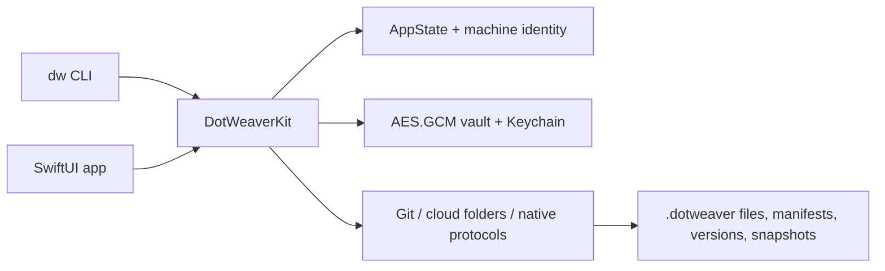

<p align="center">
  
</p>

<h1 align="center">DotWeaver</h1>

<p align="center">
  <a href="https://github.com/rausth/DotWeaver/actions"></a>
  
  <a href="LICENSE"></a>
  
</p>

DotWeaver is a native macOS dotfiles manager for synchronizing development configuration across machines with a SwiftUI app, a `dw` CLI, provider-backed storage, encrypted vault files, snapshots, conflict resolution, and release packaging for GitHub/ad-hoc distribution.



## Table of Contents

- [Features](#features)
- [Installation Matrix](#installation-matrix)
  - [Supported install paths](#supported-install-paths)
  - [Package-manager status](#package-manager-status)
- [Usage and Execution](#usage-and-execution)
  - [File tracking](#file-tracking)
  - [Providers and sync](#providers-and-sync)
  - [Planning, diff, and ignore rules](#planning-diff-and-ignore-rules)
  - [Vault, hooks, and snapshots](#vault-hooks-and-snapshots)
  - [Interop](#interop)
- [Configuration Requirements](#configuration-requirements)
  - [Environment variables](#environment-variables)
  - [.env.example](#envexample)
- [Architecture and Context](#architecture-and-context)
  - [Provider storage layout](#provider-storage-layout)
  - [Security model](#security-model)
  - [Release model](#release-model)
- [Development](#development)
- [Contributing](#contributing)
- [License](#license)

## Features

- Native macOS app built with SwiftUI.
- `dw` CLI for terminal and automation workflows.
- Folder-backed sync for iCloud, OneDrive, Google Drive, Dropbox, WebDAV, SFTP, FTPS, and S3-compatible storage.
- Native Protocol mode for WebDAV, SFTP, FTPS, and S3-compatible endpoints through system `curl`.
- Git provider with local repository storage plus optional `pull` and `push`.
- Per-machine namespaces, manifests, version history, and snapshots.
- `.dotignore` filtering for sync planning and execution.
- `dw plan` and `dw status --diff` for dry-run inspection.
- AES.GCM vault encryption before provider storage.
- Secure template variables and `{{ vault "provider.account" }}` placeholders.
- Hook execution disabled by default, hash-approved, path-contained, and audited.
- Audit log rotation with hash-chain fields.
- Sparkle framework integration and appcast generation.

## Installation Matrix

### Supported install paths

```bash
# macOS from local source
script/build_local.sh
open dist/release/DotWeaver.app

# macOS release packaging, ad-hoc signed when Developer ID credentials are absent
script/package_release.sh --local
open dist/release/DotWeaver.app

# CLI from installed app bundle, Apple Silicon/Homebrew prefix
sudo ln -sf /Applications/DotWeaver.app/Contents/MacOS/dw /opt/homebrew/bin/dw

# CLI from installed app bundle, Intel/common Unix prefix
sudo ln -sf /Applications/DotWeaver.app/Contents/MacOS/dw /usr/local/bin/dw

# Swift Package Manager tests/builds
swift test
swift build
```

### Package-manager status

DotWeaver is a macOS app and CLI. Package-manager formulas are not published yet.

```bash
# Homebrew, future formula shape
brew install rausth/tap/dotweaver

# apt, not published
sudo apt install dotweaver

# pacman, not published
sudo pacman -S dotweaver

# Node.js, not applicable to native Swift app
pnpm add dotweaver
npm install dotweaver

# Python, not applicable to native Swift app
pyenv local 3.12
python -m pip install dotweaver
```

## Usage and Execution

### File tracking

```bash
# Add files
dw add ~/.zshrc
dw add ~/.gitconfig --group git --tag work

# List monitored files
dw list
```

```text
~/.zshrc [monitored status=synced]
~/.gitconfig [monitored group=git tags=work status=synced]
```

```bash
# Pause or resume monitoring
dw monitor ~/.zshrc off
dw monitor ~/.zshrc on

# Remove from DotWeaver state
dw remove ~/.zshrc
```

### Providers and sync

```bash
# Folder-backed provider
dw provider list
dw provider set onedrive
dw provider folder ~/OneDrive

# Sync now
dw sync
```

```text
✅ Sync completed successfully
```

```bash
# WebDAV native protocol mode
dw provider transport webdav native
dw native config webdav --endpoint https://example.com/webdav/dotweaver/ --username user

# Git provider
dw provider set git
dw git config --path ~/dotfiles --remote git@github.com:example/dotfiles.git --branch main
dw git status
dw git push
```

### Planning, diff, and ignore rules

```bash
# Dry-run sync plan
dw plan

# Status with local-vs-stored content comparison
dw status --diff
```

```text
Plan
Provider: OneDrive [Mount/Sync Folder]
Root: /Users/user/OneDrive
Monitored: 8
Syncable: 7
Ignored: 1
Missing: 0
Conflicts: 0
Vaulted: 2
```

```bash
# Provider-root .dotignore
cat > ~/OneDrive/.dotignore <<'EOF'
*.local
secrets/
!keep.local
EOF
```

### Vault, hooks, and snapshots

```bash
# Toggle vault encryption for monitored file
dw vault ~/.ssh/config

# Create and inspect snapshots
dw snapshot create before-shell-change
dw snapshot list

# Full restore
dw snapshot restore before-shell-change

# Partial restore
dw snapshot restore before-shell-change --file ~/.zshrc
```

```bash
# Hooks remain disabled until explicitly enabled
dw hooks off

# Approve script hash before enabling execution
dw hooks approve ~/.dotweaver/hooks/pre-sync.zsh
dw hooks on
```

<details>
<summary>Hook execution constraints</summary>

- Hook path must be inside `~/.dotweaver/hooks`.
- Hook path must pass local path validation.
- Hook SHA-256 must match approved hash.
- Hook process receives restricted environment only:
  - `HOME`
  - `PATH=/usr/bin:/bin:/usr/sbin:/sbin`
  - `SHELL=/bin/zsh`
  - `DOTWEAVER_HOOK_PHASE`
  - `DOTWEAVER_FILE_PATH`

</details>

### Interop

```bash
# Mackup
dw interop mackup import ~/.mackup.cfg --dry-run
dw interop mackup import ~/.mackup.cfg

# chezmoi
dw interop chezmoi import ~/.local/share/chezmoi --dry-run
dw interop chezmoi export ~/.local/share/chezmoi --force
```

## Configuration Requirements

### Environment variables

Runtime variables are optional unless running tests, smoke scripts, or release packaging.

<details>
<summary>Runtime and test variables</summary>

| Variable | Required | Use |
| --- | --- | --- |
| `DOTWEAVER_APP_SUPPORT_DIR` | No | Override app support state directory for tests/smoke runs. |
| `DOTWEAVER_SNAPSHOT_DIR` | No | Override snapshot directory for tests/smoke runs. |
| `DOTWEAVER_USER_DEFAULTS_SUITE` | No | Isolate user defaults for tests/smoke runs. |
| `DOTWEAVER_ALLOW_UNSAFE_LOCAL_PATHS` | Debug only | Permit non-home local paths in debug/test contexts. |
| `EDITOR` | No | Editor used by `dw edit`. Defaults to `vi`. |

</details>

<details>
<summary>Release and notarization variables</summary>

| Variable | Required | Use |
| --- | --- | --- |
| `DEVELOPER_ID_APPLICATION` | Not for ad-hoc release | Developer ID signing identity. |
| `MACOS_CERTIFICATE_P12_BASE64` | Not for ad-hoc release | CI signing certificate payload. |
| `MACOS_CERTIFICATE_PASSWORD` | Not for ad-hoc release | CI signing certificate password. |
| `APPLE_ID` | Not for ad-hoc release | Apple notarization account. |
| `APPLE_TEAM_ID` | Not for ad-hoc release | Apple team ID. |
| `APPLE_APP_SPECIFIC_PASSWORD` | Not for ad-hoc release | Notary submission password. |
| `NOTARIZE` | No | Set `1` to request notarization when credentials exist. |
| `SPARKLE_PRIVATE_KEY` | For signed appcast | Sparkle EdDSA private key. |
| `APPCAST_URL` | For hosted validation | Hosted appcast URL. |
| `REQUIRE_SPARKLE_SIGNATURE` | No | Set `1` to require Sparkle signatures during validation. |

</details>

### .env.example

```bash
# Local test isolation
DOTWEAVER_APP_SUPPORT_DIR=/tmp/dotweaver-app-support
DOTWEAVER_SNAPSHOT_DIR=/tmp/dotweaver-snapshots
DOTWEAVER_USER_DEFAULTS_SUITE=com.example.DotWeaver.Tests

# Debug-only path bypass
DOTWEAVER_ALLOW_UNSAFE_LOCAL_PATHS=0

# CLI editor
EDITOR=nvim

# Release; leave empty for ad-hoc local builds
DEVELOPER_ID_APPLICATION=
MACOS_CERTIFICATE_P12_BASE64=
MACOS_CERTIFICATE_PASSWORD=
APPLE_ID=
APPLE_TEAM_ID=
APPLE_APP_SPECIFIC_PASSWORD=
NOTARIZE=0
SPARKLE_PRIVATE_KEY=
APPCAST_URL=https://github.com/rausth/DotWeaver/releases/latest/download/appcast.xml
REQUIRE_SPARKLE_SIGNATURE=1
```

## Architecture and Context

DotWeaver is a Swift Package targeting macOS 14 or newer.

| Layer | Technology | Responsibility |
| --- | --- | --- |
| `Sources/DotWeaver` | SwiftUI, Sparkle | GUI, menu bar flow, settings, updates. |
| `Sources/DotWeaverCLI` | Swift CLI | `dw` command surface and automation workflows. |
| `Sources/DotWeaverKit` | Foundation, CryptoKit, LocalAuthentication, Security | State, sync providers, vault crypto, snapshots, templates, security policy. |
| `Tests/DotWeaverKitTests` | XCTest | Unit and integration coverage. |

### Provider storage layout

```text
<provider-root>/.dotweaver/files/machines/<machine-id>/
<provider-root>/.dotweaver/manifests/machines/
<provider-root>/.dotweaver/manifests/files/
<provider-root>/.dotweaver/versions/
<provider-root>/.dotweaver/snapshots/
```

Folder-backed providers store each machine under its own namespace. Native Protocol providers delegate transfer to `/usr/bin/curl`. DotWeaver does not store native protocol passwords; use SSH keys, `.netrc`, endpoint tokens, or external credential helpers.

### Security model

- Local-first state model; no telemetry.
- AES.GCM vault encryption before provider storage.
- Keychain-backed vault key, Secure Enclave wrapping when available.
- Biometric/device-owner gate for credential reads, vaulted sync, and snapshot restore.
- Security-scoped bookmarks for GUI-selected files and provider folders.
- Local sync paths reject symlinks and non-home paths in release builds.
- Native Protocol endpoints reject unsupported schemes and embedded credentials.
- Hooks require explicit enablement and approved SHA-256 hash.
- Audit entries include `previousHash` and `entryHash` for tamper-evident continuity.

### Release model

```bash
# Local release artifacts
script/package_release.sh --local
script/generate_appcast.sh

# Local validation
swift test
script/smoke_provider_matrix.sh
script/validate_release_local.sh
script/smoke_app_ui.sh
```

<details>
<summary>Generated release outputs</summary>

```text
dist/release/DotWeaver.app
dist/artifacts/DotWeaver-1.0.0-macOS-universal.zip
dist/artifacts/DotWeaver-1.0.0-macOS-arm64.zip
dist/artifacts/DotWeaver-1.0.0-macOS-x86_64.zip
dist/artifacts/dw-1.0.0-macOS-universal.tar.gz
dist/artifacts/SHA256SUMS.txt
appcast.xml
```

</details>

Apple notarization requires paid Apple Developer Program credentials. Without them, release scripts build ad-hoc signed GitHub artifacts.

## Development

```bash
# Build and test
swift build
swift test

# Smoke validation
script/smoke_provider_matrix.sh
script/smoke_app_ui.sh

# Package local artifacts
script/package_release.sh --local
```

<details>
<summary>Expected validation baseline</summary>

```text
Swift tests pass.
Provider matrix smoke passes for iCloud, OneDrive, Google Drive, Dropbox, WebDAV, SFTP, FTPS, S3, and Git.
App launch smoke passes.
Local release packaging creates app, CLI, archives, checksums, and appcast.
```

</details>

## Contributing

Read [CONTRIBUTING.md](Docs/CONTRIBUTING.md), [Code of Conduct](Docs/CODE_OF_CONDUCT.md), and [Security Policy](Docs/SECURITY.md).

Use focused changes, include tests for behavior changes, and run:

```bash
swift test
script/smoke_provider_matrix.sh
script/smoke_app_ui.sh
```

## License

DotWeaver is licensed under the MIT License. See [LICENSE](LICENSE).
