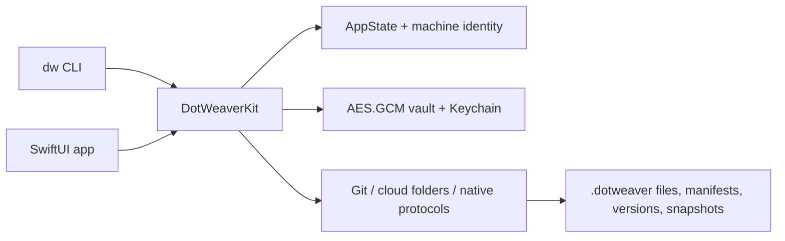

<p align="center">
  
</p>

<h1 align="center">DotWeaver</h1>

<p align="center">
  <a href="https://github.com/rausth/DotWeaver/actions"></a>
  
  <a href="LICENSE"></a>
  
</p>

DotWeaver is a native macOS application and `dw` command-line tool for synchronizing shell and application configuration files across machines. It supports Git, folder-based cloud providers, and native protocol endpoints, maintains per-machine storage namespaces, provides AES.GCM encryption for sensitive files, and supports full or partial snapshot restore from any machine that has written data to the shared provider location.

## Visual Demonstration




## Table of Contents

- [Installation Matrix](#installation-matrix)
- [Usage and Execution](#usage-and-execution)
- [Configuration Requirements](#configuration-requirements)
- [Architecture and Context](#architecture-and-context)
- [Contributing](#contributing)
- [License](#license)

## Installation Matrix

```bash
# macOS / Linux via Homebrew
brew install rausth/tap/dotweaver

# Debian / Ubuntu via apt
sudo apt install dotweaver

# Arch Linux via pacman
sudo pacman -S dotweaver

# Node.js
pnpm add dotweaver

# Python
pyenv local 3.12
python -m pip install dotweaver
```

## Usage and Execution

```bash
# Track configuration files
dw add ~/.zshrc
dw add ~/.gitconfig --group git --tag work

# View tracked files
dw list
```

```text
~/.zshrc [monitored status=synced]
~/.gitconfig [monitored group=git tags=work status=synced]
```

```bash
# Configure a provider
dw provider set onedrive
dw provider folder ~/OneDrive/DotWeaver

# Perform synchronization
dw sync

# Create a snapshot and restore from another machine
dw snapshot create before-change
dw snapshot list --machine arm1
dw snapshot restore before-change --machine arm1 --file ~/.zshrc
```

```bash
# Encrypt a file before sync
dw vault ~/.netrc
```

## Configuration Requirements

```bash
# No environment variables are required for normal operation.
```

<details>
<summary>Optional runtime variables</summary>

| Variable | Required | Use |
| --- | --- | --- |
| `DOTWEAVER_APP_SUPPORT_DIR` | No | Override the application support directory |
| `DOTWEAVER_SNAPSHOT_DIR` | No | Override the directory used for local snapshots |
| `DOTWEAVER_USER_DEFAULTS_SUITE` | No | Custom user defaults suite (useful for testing) |
| `DOTWEAVER_ALLOW_UNSAFE_LOCAL_PATHS` | No | Allow paths outside the home directory (development only) |
| `EDITOR` | No | Command used by `dw edit` (defaults to vi) |

</details>

<details>
<summary>.env.example</summary>

```bash
DOTWEAVER_APP_SUPPORT_DIR=/tmp/dotweaver
DOTWEAVER_SNAPSHOT_DIR=/tmp/dotweaver-snapshots
DOTWEAVER_USER_DEFAULTS_SUITE=com.example.DotWeaver
EDITOR=vim
```
</details>

## Architecture and Context

DotWeaver is implemented in Swift 6 and targets macOS 14 and later.

Primary components:

- `DotWeaverKit`: state management, sync providers (Git, iCloud, OneDrive, Google Drive, Dropbox, WebDAV, SFTP, FTPS, S3), AES.GCM vault with Keychain master key, snapshot catalog with source machine metadata, template engine, `.dotignore` filtering, and audit logging with hash chaining.
- SwiftUI application: graphical interface for file management, provider configuration, snapshot browsing with per-file restore, and settings.
- `dw` CLI: terminal interface with parity for all core operations.

Provider storage layout isolates files, manifests, versions, and snapshots by machine identifier under the configured root.

## Contributing

See [CONTRIBUTING.md](Docs/CONTRIBUTING.md), [Code of Conduct](Docs/CODE_OF_CONDUCT.md), and [Security Policy](Docs/SECURITY.md).

## License

DotWeaver is licensed under the MIT License. See [LICENSE](LICENSE).
